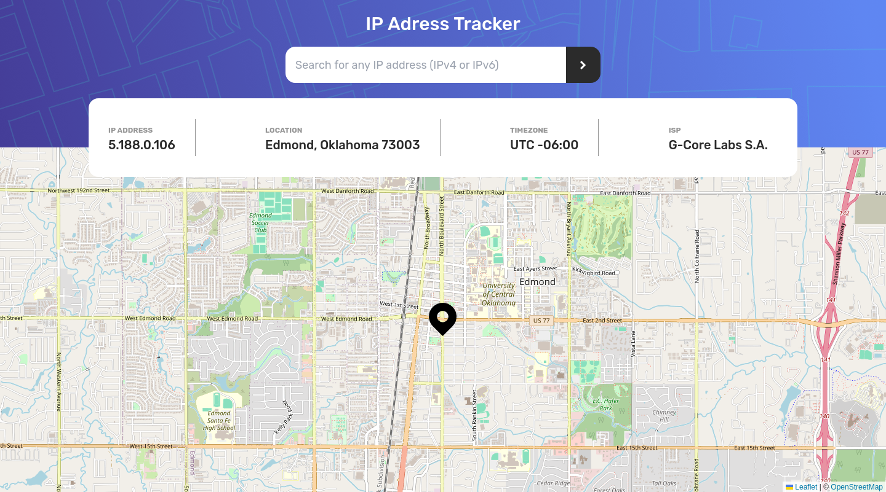
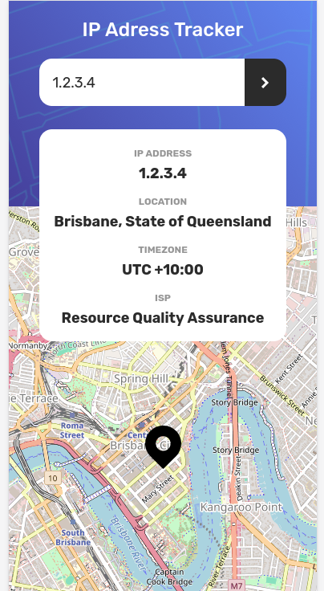

# Frontend Mentor - IP address tracker solution

This is a solution to the [IP address tracker challenge on Frontend Mentor](https://www.frontendmentor.io/challenges/ip-address-tracker-I8-0yYAH0). Frontend Mentor challenges help you improve your coding skills by building realistic projects. 

## Table of contents

- [Overview](#overview)
  - [The challenge](#the-challenge)
  - [Screenshot](#screenshot)
  - [Links](#links)
- [My process](#my-process)
  - [Built with](#built-with)
  - [What I learned](#what-i-learned)
  - [Continued development](#continued-development)
  - [Useful resources](#useful-resources)
- [Author](#author)
- [Acknowledgments](#acknowledgments)

## Overview

### The challenge

Users should be able to:

- View the optimal layout for each page depending on their device's screen size
- See hover states for all interactive elements on the page
- See their own IP address on the map on the initial page load
- Search for any IP addresses or domains and see the key information and location

### Screenshot

### Links
- Solution URL: [IP Address Tracker Solution](https://github.com/garyeung/Frontend-Mentor-Challenges/tree/master/ip-address-tracker-master)
- Live Site URL: [IP Address Tracker Live](https://garyeung.github.io/Frontend-Mentor-Challenges/ip-address-tracker-master)

## My process

### Built with

- [React](https://reactjs.org/) - JS library
- [Vite](https://vitejs.dev/)  - For development and building 
- [TailwindCSS](https://tailwindcss.com/) - CSS Framework
- [IPify](https://geo.ipify.org/) - Get the IP Address locations
- [LeafletJS](https://leafletjs.com/) - Generate the map

### What I learned

Learned how to fetch data, what asynchronous programming is, customize React Hook for my target and how to combine my program with third party APIs.

### Continued development

optimise the asynchronous function and to learn deeply what is Promise

### Useful resources

## Author

## Acknowledgments